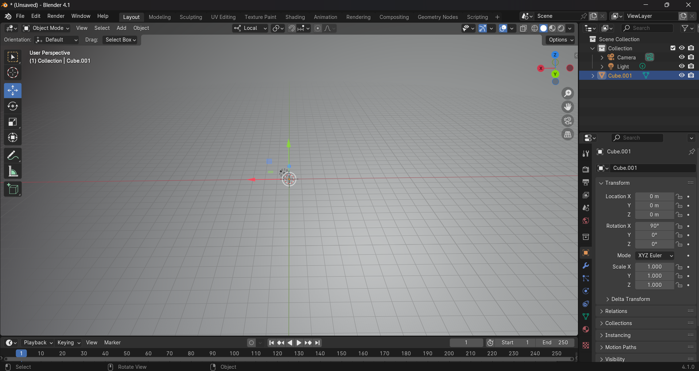

# solar-system

Simulation of the solar system using using CesiumJS.

Getting started:

- https://sandcastle.cesium.com/?src=CZML.html
- https://cesium.com/learn/cesiumjs-learn/cesiumjs-quickstart/
- https://github.com/CesiumGS/cesium/tree/main/Apps

CZML:

- https://community.cesium.com/t/leadtime-and-trailtime-in-simple-czml/2749/2
- https://stackoverflow.com/questions/24823310/cesium-czml-using-lat-long-alt
- https://github.com/AnalyticalGraphicsInc/czml-writer/wiki/Packet
  - For position, the array is time lat long alt for cartographic or time x y z for cartesian
- https://support.esri.com/en-us/gis-dictionary/geocentric-coordinate-system#:~:text=The%20x%2Daxis%20is%20in,positive%20toward%20the%20north%20pole.
- https://community.cesium.com/t/animation-cotrol-speed/3178/2
  - 60x clock multiplier => 1 tick = 1 min

Heliocentric position of planets:

- http://www.stargazing.net/kepler/ellipse.html
- https://ssd.jpl.nasa.gov/planets/approx_pos.html
- https://omniweb.gsfc.nasa.gov/coho/helios/heli.html
  - Select solar ecliptic since that's heloiocentric coordinates. Then, either download the file which will give cartographic coords, or download the x y z coordaintes which will give cartograhpic ones.

Importing 3D models:

- https://sandcastle.cesium.com/index.html#c=jVPfb5swEP5XLF4CUmTSdVrWhkaLsikvnbYpWp94ueALeDU2sg1ROu1/r4GQQMqmISTju+9+fHcfFWiigfHSkAfy7v3dfDabLWIZhmfjh9v5x5vbuTPGsnLoiuMBtXNIPJA1Gl7m9Kmx+ZOkua6VtMAl6smU/I4lcY/JVCnYSvIcLJJ7sgdhcHryPR9XNlemyFDj0JVD8V2rX5hYruR9v+IGVaqhyHhyAfg9/xcheGEUZ35LZDo4giCWf4KG0hYkS8BYgVSjQeuI7UvZ5gu69lvOlIGFrSq1o0mBMf9Ua/2Si89nFxUKmD+hNHTvFvJCYO0MDa8/aeLAk6Cu3SR2A8Wu1eFM3zAgw7Ntv0uSCrXDYYJNbfLP2S/4BktRwk7gI08zy2Va064Hv+hD3NYOG61KyS4L6gEv1V3VsYVc9TO2spH2TsM2CUqkHa/mXPwNQHdgcK2EqnXZbaW+0tWPn6vxzHuVnmbArsgPYLlSshnEv0Cm/A9MBkwdvkIxUtWpceFNvcjYo8BlG/zJ6UVpS0otfKcki04+7ucx4a5MntHSxDQSiMIuKGK8Ipw9xN7Vbxh7JBFgjPPsSyG2/AVjbxmFDj8Iq4XrpPCtQi3gWEOym+Vja6SURqG7vo2ySokd6F7GVw
- https://sandcastle.cesium.com/?src=3D%20Models.html
- https://github.com/epn-vespa/cesium/tree/planetary/Apps/PlanetaryCesiumViewer

Camera position:

- https://sandcastle.cesium.com/index.html?src=Camera.html
  - in ICRF the sky doesn't rotate, instead the Earth does
- https://github.com/CesiumGS/cesium/issues/8859#issuecomment-630424621
  - ICRF continually updates

Path interpolation:

- https://sandcastle.cesium.com/index.html#c=pVZbc+I2FP4rGl7WNI6AJdlkgc2UYXc76WQDE5j0hZmOsA+grix5JBlCO/nvPZIv2GQ7aVo/gHTu5zufZO+YJjsOe9DkE5GwJxMwPEvoo5cF7yK/nShpGZeg34Xkr6Uk+Ei24xtmuZK30lidRW5pbiW3nAlxeOSGrwQMyJoJA0v53B4u5VLuMJ3MkhXo6XqsI4NJL7vDXG4s0/ZOSZSdX100hMyisP8xD+Ero5FQ0ff894HJDaBBUfqkktG76XT2+3wxnVXJfbwFT5x9I1KlKBInPC7MirC/ZoIz+ZlZoCyO5xApGZugcgvJRf99txvWQTy6BO121ZBK3xj4+sPFK4GXcq00CVx8joG7Q/wbNYAekrMz3i6H5wwjJZSuoea2dK1VgtDFKgkKU/cwkW4ZGZAe7eZCP80ykOsoH1sR6huzWyrhyeaR7n0ZQZv8RPqX1+Sc9K4+nrr7Ab/q3rty7tc5D5x/p0MmGhAGwjCOZnyztecCiUpSF+SYJNUqBW0PTZLPWZIKiGfKcMfeWWEUNLvDOZQWNbhQiism+x6zz7DRAMXUEIywIm5IumW4sgg/Zp+6PuVGolN831CAH0ZYwvpa+pyMYSNJu47vVy5jYrfgDkSquLRErf2+xNtDHRKcFUGBAcKtQcZYbrMYaiNA/5n3b7SgNpqlWx75JqqegqrWDdhHJjIIivPYLrspw9Et+Cr+BX0uu+4hZ+R9vhqeFFdBXFwMJgIJdCPUCigIwVOjeEyjWtULdSz5eFzK0hpH9jiv8sgWAD9ArDygDkdiFVmB3zpfpiPaHN7bCPwfGPcDlwL6sI7S/yNVeWgl+SKRKAfXttmqvW/82LSbDO4Km2ou4PYcjMtZv6bScoKDqqzwqMW0C4ey5yA3RKXOlomQ3JI/MmPJnkkLsS8FHItpPbJzGpBaMi/mTyDm/E9A1XXY1OXX66B5vS4exvfz2fjhy/3ixFxl1t1bk8LLe//Y5DceI08GpH/UPtcsPYteVKrBKJEV4PTce6qpT3AcGl/cqK3Ra6bEwaX8Raj9t8Ki4thJBvfgUdnPlPuWGJAu7X0IX5pE9Qab6uf2if2+6LR3Wq0A5hmJKnihdNeSOGprKNXeXfmy4hYtqUMN2FukgU6V8B83U88SU++W1/X5vYtFXob/YDEWG6W53SZHMtwxvD/w+8ThK1WCqI5TZOwTT7xHrc5nV2orbI2MPQi4WcqfeZIqbUmmRUBpxwIeOZyM6ayy6DtYGhnj/Ead0mEU8x3h8adl6+RTbtkikWDGoGadCU/jZetm1EH7hptQLOZyM92BFuzgTLa9m7tcSCkddXD70ssqJVZMVxH/Bg

higher resolution => lower granularity path.

```
"resolution": 10000,
      "leadTime": [
        {
          "interval": "2000-01-01T00:00:00Z/2011-01-01T00:00:00Z",
          "epoch": "2000-01-01T00:00:00Z",
          "number": [
            0,
            31536000,
            31536000,
            0
          ]
        }
      ],
      "trailTime": [
        {
          "interval": "2000-01-01T00:00:00Z/2011-01-01T00:00:00Z",
          "epoch": "2000-01-01T00:00:00Z",
          "number": [
            0,
            0,
            31536000,
            31536000
          ]
        }
      ]
```

Planet rotation with time:

- https://github.com/AnalyticalGraphicsInc/czml-writer/wiki/Orientation
- https://en.wikipedia.org/wiki/Conversion_between_quaternions_and_Euler_angles
  - Relation between quaternion and direction cosines
- https://docs.advancednavigation.com/certus/SensorCoordinate.htm#_Axes
  - Understanding roll pitch yaw
- https://stackoverflow.com/questions/43389069/cesium-how-to-animate-an-aircraft-from-pitch-roll-heading
  - Make a sandbox using this, shows how wuaternions work wrt roll pitch and yaw
  - Need to make the model url ../ and .glb
- https://gist.github.com/thw0rted/4857eea152fcc54265330c00775f0fb5
- https://cesium.com/learn/ion-sdk/ref-doc/HeadingPitchRoll.html
  - A rotation expressed as a heading, pitch, and roll. Heading is the rotation about the negative z axis. Pitch is the rotation about the negative y axis. Roll is the rotation about the positive x axis.
- 

Removing sandcastle elements:

- https://community.cesium.com/t/only-display-3d-model-without-globe/10545/2

Access entities from datasource
Update czml from js

- https://groups.google.com/g/cesium-dev/c/5WaK5vgNaSI
